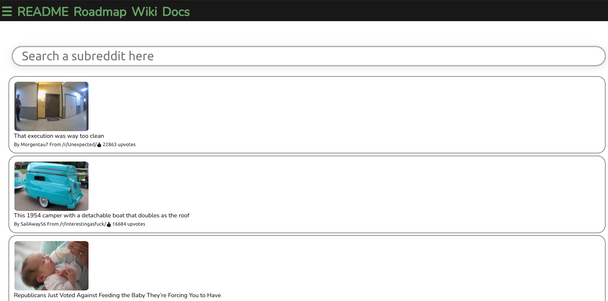

# CleanReed

Data rendering app showcasing current posts inside reddit



## Why this app as created: 

Proof of concept: I created this app with the intent of having a better, organized, and minimalist approach for browsing subreddit pages. The end goals for this projects are:

1) To automatically take posts from any subreddit you choose from and displaying everything neatly in rows,

2) Allowing users to also securely link their reddit account credentials with the app

3) For my small React app to be used as a tool/add-on/extension by regular reddit users

Disclamer: This project is not supported, endoresed or sponsered by either Reddit or Advance Publications. This project is only designed to be an Open Source tool for users in the site
## How to use:

1. Clone repo into desired directory ```git clone https://github.com/Toughee/CleanReed.git``` or ```gh repo clone Toughee/CleanReed```
2. Run ```npm install``` in your terminal to install all app node modules and dependencies
3. Run ```yarn start``` in your terminal to run app on http://localhost:3000/

## Testing tools used for app:

- React Testing library
- Jest
- Mocha
- Cypress
- Webpack
- TravisCI
- CircleCI
- ESLint, CSSLint and StyleLint
## Project resources:

- [Current roadmap for app](https://github.com/Toughee/CleanReed/projects/1)
- [Wiki page](https://github.com/Toughee/CleanReed/wiki)
- [Documentation for project contributors](https://github.com/Toughee/CleanReed/tree/main/docs)

### Future app goals:

- [ ] App can extract data from a specific subreddit API and show it inside the page.
- [ ] App returns 403 and 404 error page if subreddit is either restricted or non-existant
- [ ] Add the option for endless page scrolldown for a chosen subreddit
- [ ] Add video/gif walkthrough of app use
- [ ] Add Typescript for all app components
- [ ] Perfect the UI design UX experience for app. Make app responsive to mobile users

### Completed tasks:

- [x] User has the option to search for any subreddit currently available (Currently displays inside the console as in JSON format) 
- [x] Improve the UI design for app
### Completed tasks for earlier version of app:

- [x] Align all posts into small rows
- [x] Perfect the color scheme and page layout for app 
- [x] App extracts .json data from corresponding subreddits
- [x] Develop tests for each React component
- [x] Include CircleCI and Travis-CI inside project
- [x] Add a permalink url to each post made